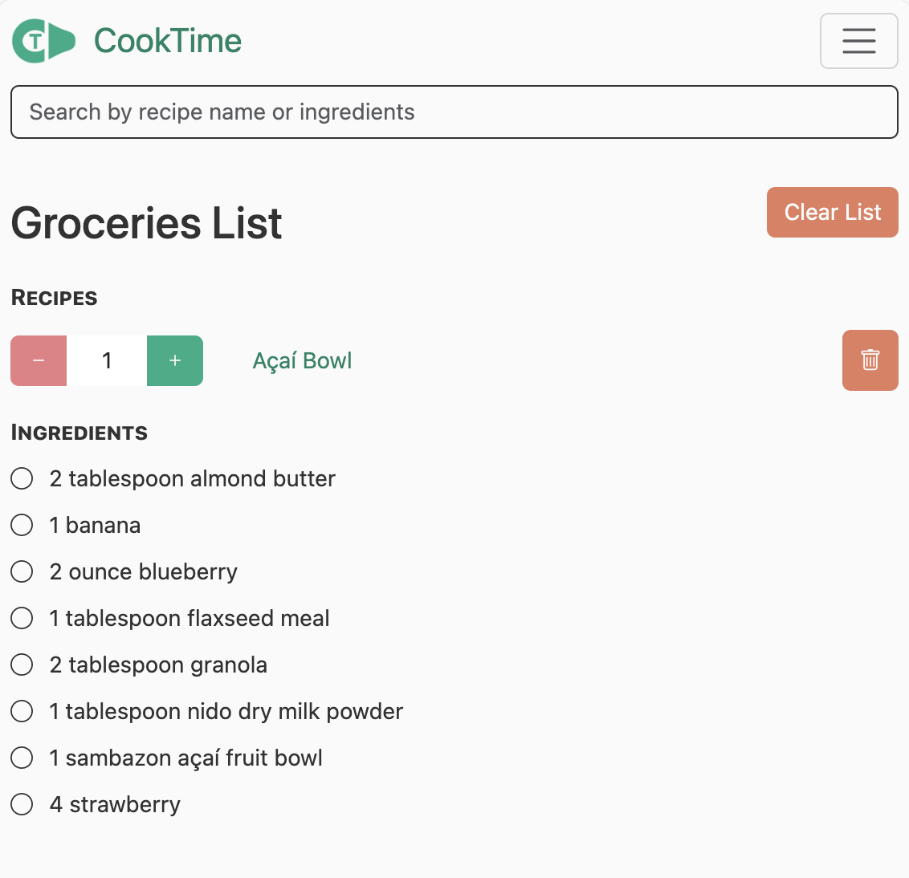
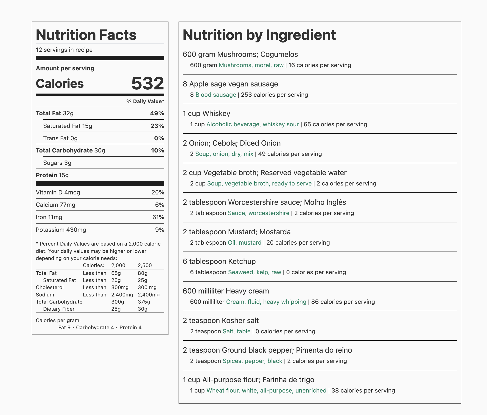
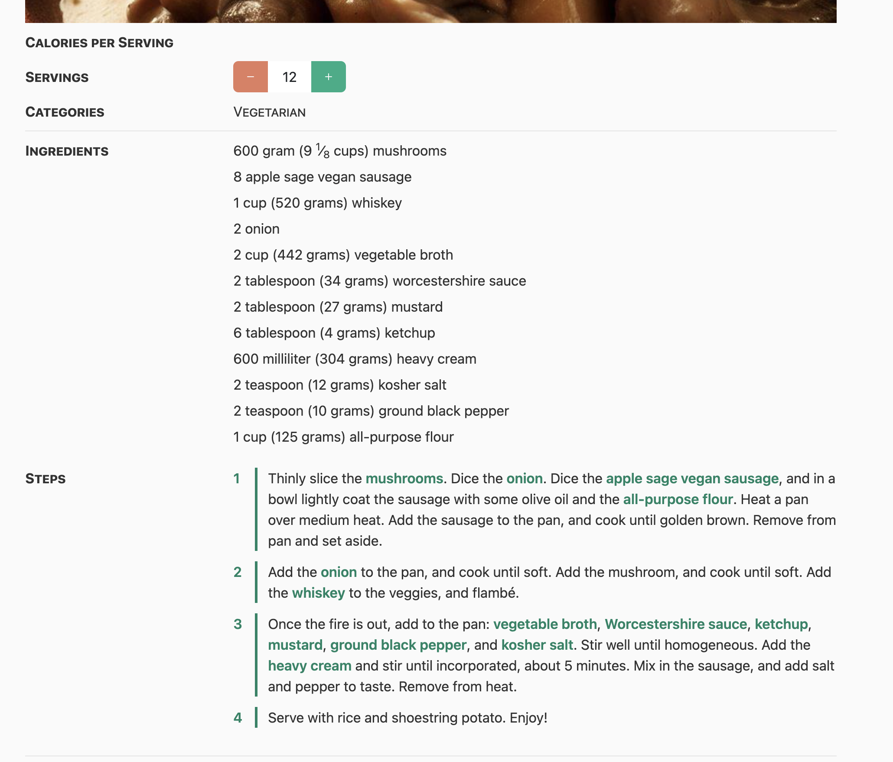
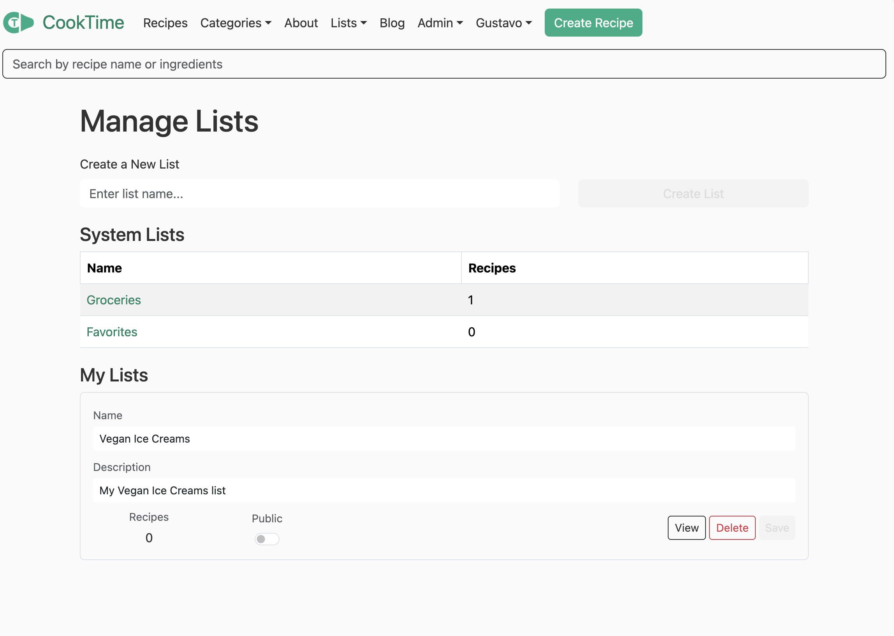

# CookTime

CookTime is a recipe management system!
It is composed of:

1. REST API (C# ASP.NET app in `src/CookTime`)
1. Browser application (React SPA in `src/CookTime/client-app`)
1. PostgreSQL schemas and functions for storing and querying recipes (SQL statements in `src/CookTime/Scripts`)

With CookTime you can do things like:

1. Store your recipes in a database
1. Query recipes by name, ingredient, or arbitrary properties
1. Scale recipes by servings
1. Compute a recipe's nutrition facts
1. Track grocery lists of ingredients to make sets of recipes

## Features

### Recipe Index

Search by whatever you want!


### Grocery Lists

Aggregate ingredients into one grocery list!



### Nutrition Facts

Automatically computed nutrition facts using USDA nutrition data!



### Recipe scaling

Scale recipes to make more or less servings!



### Recipe lists

Come up with your own recipe lists, and share them with the world!



### Social sign on

No more username and passwords!


## Getting started

Assuming [Docker Desktop][Docker Desktop] installed on Linux or macOS,
use the `scripts` directory (found at the root of the repo) contents to get started:

```shell
scripts/server
```

Then open <http://localhost:3000> in a browser!

I recommend using VSCode to develop CookTime, for that you will need to install:

1. [.NET 10](https://dotnet.microsoft.com/en-us/download/dotnet/10.0)
1. [Node.js](https://nodejs.org/en/download) (latest LTS release)

## Blog

The blog is served as static files.
If you add or modify a blog post, you only need to regenerate the static files.
To do that, run the following in the `Blog` directory:

```bash
jekyll build -d ../wwwroot/Blog
```

That will dump new blog contents into the static files directory `wwwroot`.
Commit the changes after you generate the new blog post.

[Docker Desktop]: <https://www.docker.com/products/docker-desktop/>
